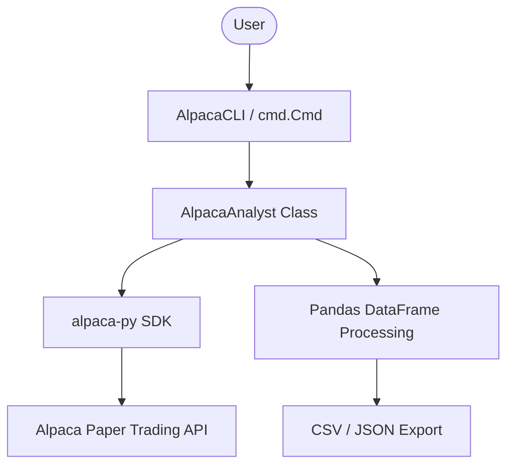

# Requirements

### Overview & Goals
The goal is to provide a standalone, professional-grade Python CLI tool for interacting with the Alpaca Paper Trading API. This tool will allow quantitative analysts to fetch trade history and current positions interactively, process them into clean Pandas DataFrames, and export them for further analysis—all without leaving the terminal.

### Scope
- **In Scope**:
  - Development of `alpaca_analyst.py`.
  - Integration with `alpaca-py` SDK.
  - Interactive CLI using the `cmd` module.
  - Data fetching (Trades/Positions).
  - Data transformation (Pandas DataFrames).
  - Data export (CSV/JSON).
  - Modular, class-based architecture.
- **Out of Scope**:
  - GUI or Streamlit integration (explicitly excluded by user).
  - Real-time trading/execution (focused on data retrieval).
  - Integration with existing `alpaca_trader.py` (which uses `requests`).

# Technical Design

### Current Implementation
The project currently has `alpaca_trader.py` and `trade_strategy_runner.py`, both of which use the `requests` library for direct REST API calls. They are primarily used as utility modules for the Streamlit UI or specific strategy execution.

### Key Decisions
1. **SDK Choice: `alpaca-py`**: Using the official Alpaca Python SDK ensures compatibility with the latest API features and provides a more Pythonic interface than raw `requests`.
2. **CLI Framework: `cmd` Module**: Utilizing the built-in `cmd` module provides a robust, interactive shell experience (tab completion, history) with minimal dependencies.
3. **Data Model: Pandas DataFrames**: All API responses will be normalized into DataFrames to facilitate immediate analysis and consistent exporting.

### Proposed Changes
- **New File**: `alpaca_analyst.py`
- **Class `AlpacaAnalyst`**:
  - Handles authentication and SDK clients (`TradingClient`).
  - Methods: `get_positions()`, `get_activities(filters)`, `to_dataframe(data)`.
- **Class `AlpacaCLI`**:
  - Inherits from `cmd.Cmd`.
  - Commands: `fetch_trades`, `fetch_positions`, `export`, `params`, `status`.
- **Logic**:
  - On start: Load `.env`, initialize SDK, enter loop.
  - Interactive loop: Wait for user commands, update internal state/DataFrames.

### File Structure
```
stock_screener/
├── alpaca_analyst.py (NEW)
├── requirements.txt (UPDATE: add alpaca-py)
└── .env (Ensure APCA_* keys are present)
```

### Architecture Diagram


# Testing

### Validation Approach
Verification will be done via manual testing of the CLI tool in a terminal environment.

### Key Scenarios
1. **Authentication**: Verify that the tool correctly identifies missing or invalid API keys.
2. **Interactive Parameters**: Change `start_date` and `symbol` within the shell and verify that the next `fetch_trades` call uses them.
3. **Data Quality**: Check that the resulting DataFrames have correct types (e.g., numeric prices, datetime objects).
4. **Export**: Confirm that `export --format csv` creates a valid file in the local directory.

### Edge Cases
- No trades found for the given criteria.
- API rate limiting or connection timeouts.
- Invalid date formats entered by the user.

# Delivery Steps

### ✓ Step 1: Design and initialize the Alpaca CLI Tool structure
Define the `AlpacaAnalyst` core class and CLI loop structure.

- Create `alpaca_analyst.py`.
- Implement `AlpacaAnalyst` class for SDK initialization and API calls.
- Implement `AlpacaCLI` class using the `cmd` module for interactive user input.
- Add logging and error handling for API connections.
- Ensure environment variable loading (APCA_API_KEY_ID, APCA_API_SECRET_KEY, APCA_API_BASE_URL).

### ✓ Step 2: Implement Data Fetching and Pandas Integration
Implement functions to fetch and transform Alpaca data into Pandas DataFrames.

- Add `fetch_trades` method to retrieve historical trades via `Account Activities` or `Orders`.
- Add `fetch_positions` method to retrieve current portfolio positions.
- Implement DataFrame conversion logic with proper timestamp handling and column cleaning.
- Add dynamic parameter support (e.g., symbol filtering, date ranges) within the CLI commands.

### ✓ Step 3: Implement Export Logic and CLI Refinement
Add export capabilities and refine the CLI user experience.

- Implement `export` command to save DataFrames as `.csv` or `.json`.
- Add command-line arguments parsing for non-interactive execution (optional but helpful).
- Refine the interactive loop with a help menu and clear status messages.
- Add a "live update" or "refresh" feature if requested.
- Create a `README_ALPACA.md` or update `README.md` with usage instructions.